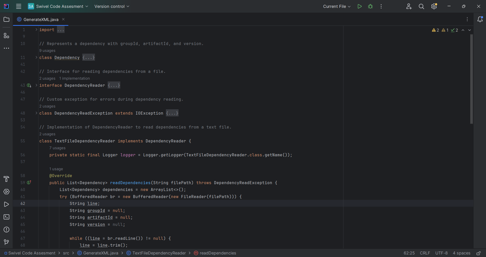
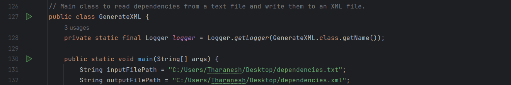

# Swivel Code Assesment - Java

<br>



## Introduction

I'm Tharanesh Vigneshwaran, an undergraduate student from the Informatics Institute Of Technology and I'm thankful for the opportunity provided by [Swivel](https://www.swiveltech.io/). I have completed the assignment of creating a text to XML converter using Java.

## Getting Started

The recommended methods to setup a copy of the application on your local machine.

### Prerequisites

1. Check if your local machine has Java installed.

   ```sh
   java -version
   ```

### Installation

1. Clone the repository on your local machine.

   ```sh
   git clone
   ```

2. Move to the Swivel-Code-Assignment folder.

   ```sh
   cd Swivel-Code-Assignment
   ```

3. Add the absolute path(not relative path) within line numbers 131 and 132 within the GenerateXML.java

   

   <br>

   

   The text file provided within the repository will be similar to the screenshot above.

4. Compile the Java application.

   ```sh
   javac GenerateXML.java
   ```

5. Run the Java application.

   ```sh
   java GenerateXML
   ```

   

   The output XML file will be similar to the screenshot above.

## License

The assignment is distributed under the MIT License. Read the `LICENSE` file for more details.

## References Utilised:

1. [Logging in Java — Log4j vs Logback vs SLF4J](https://medium.com/javarevisited/logging-in-java-log4j-vs-logback-vs-slf4j-88c533088d2a)

2. [Logger log() Method in Java with Examples](https://www.geeksforgeeks.org/logger-log-method-in-java-with-examples/)

3. [Exceptions in Java](https://www.geeksforgeeks.org/exceptions-in-java/)

4. [All you Need to Know About Solid Principles in Java](https://www.edureka.co/blog/solid-principles-in-java/)
